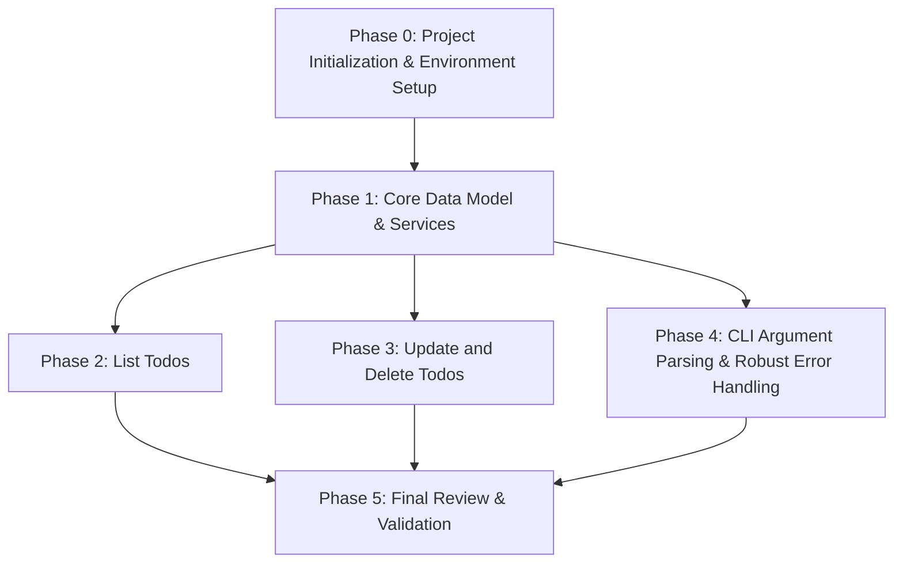

# Tasks: In-Memory Python Todo CLI App

**Feature Branch**: `001-in-memory-todo`
**Created**: 2025-12-06
**Status**: Draft
**Input**: `specs/001-in-memory-todo/plan.md`, `specs/001-in-memory-todo/spec.md`

**Note**: This file is generated by the `/sp.tasks` command based on the feature spec and implementation plan.

## Implementation Strategy

This project will follow an MVP-first, incremental delivery approach. Foundational tasks will be completed first, followed by user stories in priority order (P1, then P2). Each user story will be developed and tested as a self-contained increment before moving to the next. Cross-cutting concerns like robust argument parsing and error handling will be addressed in a dedicated phase.

## Dependencies Overview

This diagram illustrates the recommended sequence for completing user stories and foundational phases.

## Parallel Execution Examples

Many tasks within a single phase, especially those involving independent file creations or unit tests, can be executed in parallel to speed up development.

### Example: Phase 0 - Project Initialization

Tasks `T002`, `T003`, `T004`, `T005`, `T006`, `T007`, `T008`, `T009`, `T010` can be run in parallel.

### Example: User Story 1 (Add Todo) & User Story 5 (Mark Complete/Incomplete) - Phase 1

Within Phase 1, tasks related to implementing the `Todo` model and the initial `TodoService` methods (Add & Mark Status) can be parallelized:

*   `T011` (Model definition)
*   `T012`, `T013` (Service methods)
*   `T014`, `T015` (Unit tests)

### Example: User Story 2 (List Todos) - Phase 2

*   `T016` (Service method)
*   `T017` (CLI Integration)
*   `T018` (Unit tests)
*   `T019` (Integration tests)

## Phase 0: Project Initialization & Environment Setup

**Goal**: Establish the basic project structure and ensure the development environment is ready.

- [X] T001 Initialize `pyproject.toml` with basic project metadata
- [X] T002 Create a `uv` virtual environment using `uv venv`
- [X] T003 [P] Install `rich` dependency using `uv pip install rich`
- [X] T004 [P] Install `pytest` dependency using `uv pip install pytest`
- [X] T005 [P] Create `src/` directory
- [X] T006 [P] Create `tests/` directory
- [X] T007 [P] Create `tests/unit/` directory
- [X] T008 [P] Create `tests/integration/` directory
- [X] T009 [P] Create empty file `src/cli.py`
- [X] T010 [P] Create empty file `src/models.py`
- [X] T011 [P] Create empty file `src/services.py`
- [X] T012 [P] Create empty file `tests/unit/test_models.py`
- [X] T013 [P] Create empty file `tests/unit/test_services.py`
- [X] T014 [P] Create empty file `tests/integration/test_cli.py`
- [X] T015 Create `requirements.txt` from `pyproject.toml` using `uv pip freeze > requirements.txt`

## Phase 1: Core Data Model & Services (User Story 1 & 5 - P1 Dependencies)

**Goal**: Implement the core `Todo` data model and foundational `TodoService` methods for adding and marking todos. These are critical prerequisites for all other user stories.

**Independent Test Criteria**:
- A todo item can be added successfully.
- A todo item's completion status can be toggled and verified.

- [X] T016 [US1] Define `Todo` class with `id`, `description`, `completed` attributes in `src/models.py`
- [X] T017 [US1] Implement `__init__` method for `Todo` in `src/models.py`
- [X] T018 [US1] Write unit tests for `Todo` model initialization and attributes in `tests/unit/test_models.py`
- [X] T019 [US1] Implement `TodoService` class with in-memory storage in `src/services.py`
- [X] T020 [US1] Implement `add_todo(description)` method in `src/services.py` to add new todos and assign unique IDs
- [X] T021 [US5] Implement `mark_todo_status(todo_id, completed)` method in `src/services.py` to update todo status
- [X] T022 [US1] Write unit tests for `TodoService.add_todo` method in `tests/unit/test_services.py`
- [X] T023 [US5] Write unit tests for `TodoService.mark_todo_status` method (success and non-existent ID) in `tests/unit/test_services.py`

## Phase 2: List Todos (User Story 2 - P1)

**Goal**: Enable users to view all current todo items.

**Independent Test Criteria**:
- All added todo items are displayed correctly when listed.
- A message indicating no todos is shown when the list is empty.

- [X] T024 [US2] Implement `list_todos()` method in `src/services.py` to retrieve all todos
- [X] T025 [US2] Write unit tests for `TodoService.list_todos` method in `tests/unit/test_services.py`
- [X] T026 [US2] Implement CLI command to display todos, utilizing `rich` for tabular output in `src/cli.py`
- [X] T027 [US2] Write integration tests for `list` CLI command (empty and populated list) in `tests/integration/test_cli.py`

## Phase 3: Update and Delete Todos (User Story 3 & 4 - P2)

**Goal**: Provide functionality to modify existing todo descriptions and remove unwanted todos.

**Independent Test Criteria**:
- An existing todo's description can be updated and the change is reflected.
- An existing todo can be deleted and is no longer present in the list.

- [X] T028 [US3] Implement `update_todo(todo_id, new_description)` method in `src/services.py`
- [X] T029 [US4] Implement `delete_todo(todo_id)` method in `src/services.py`
- [X] T030 [US3] Write unit tests for `TodoService.update_todo` method (success, non-existent ID, empty description) in `tests/unit/test_services.py`
- [X] T031 [US4] Write unit tests for `TodoService.delete_todo` method (success, non-existent ID) in `tests/unit/test_services.py`
- [X] T032 [US3] Implement CLI command for updating todos in `src/cli.py`
- [X] T033 [US4] Implement CLI command for deleting todos in `src/cli.py`
- [X] T034 [US3] Write integration tests for `update` CLI command in `tests/integration/test_cli.py`
- [X] T035 [US4] Write integration tests for `delete` CLI command in `tests/integration/test_cli.py`

## Phase 4: CLI Argument Parsing & Robust Error Handling (Cross-Cutting)

**Goal**: Implement robust command-line argument parsing and comprehensive error handling for a smooth user experience.

- [X] T036 Implement `argparse` for all CLI commands (add, list, update, delete, complete, incomplete) in `src/cli.py`
- [X] T037 Add input validation for `add` command (non-empty description) in `src/cli.py`
- [X] T038 Add input validation for ID parameters (numeric, positive) in `src/cli.py` and `src/services.py`
- [X] T039 Implement error handling for non-existent todo IDs across all relevant service methods in `src/services.py`
- [X] T040 Display user-friendly error messages using `rich` for all validation failures in `src/cli.py`
- [X] T041 Display user-friendly error messages using `rich` for non-existent IDs in `src/cli.py`
- [X] T042 Ensure consistent error exit codes for CLI operations
- [X] T043 Update integration tests in `tests/integration/test_cli.py` to cover error handling scenarios

## Phase 5: Final Review & Validation

**Goal**: Ensure code quality, full functionality, performance, and maintainability.

- [X] T044 Conduct a code review for adherence to clean architecture and Python best practices
- [X] T045 Refactor code for clarity, modularity, and maintainability
- [X] T046 Run all unit tests to confirm individual component correctness
- [X] T047 Run all integration tests to confirm end-to-end functionality
- [X] T048 Verify performance goals (<100ms response, <10MB memory for 1000 todos) are met
- [X] T049 Update `README.md` with comprehensive usage instructions for all commands
- [X] T050 Conduct a final modularity check: confirm ease of future extensions (e.g., persistence layer)

